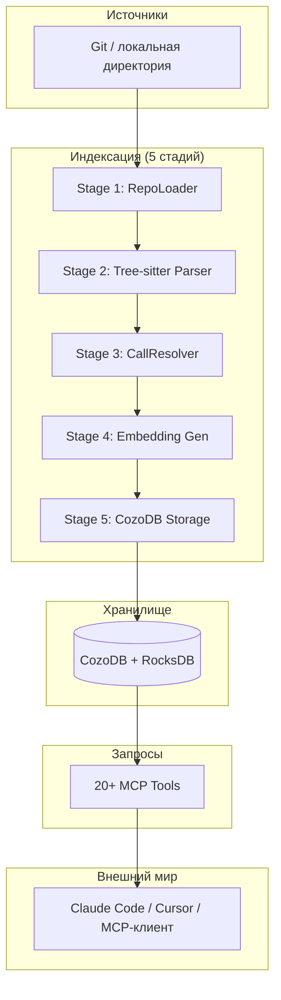
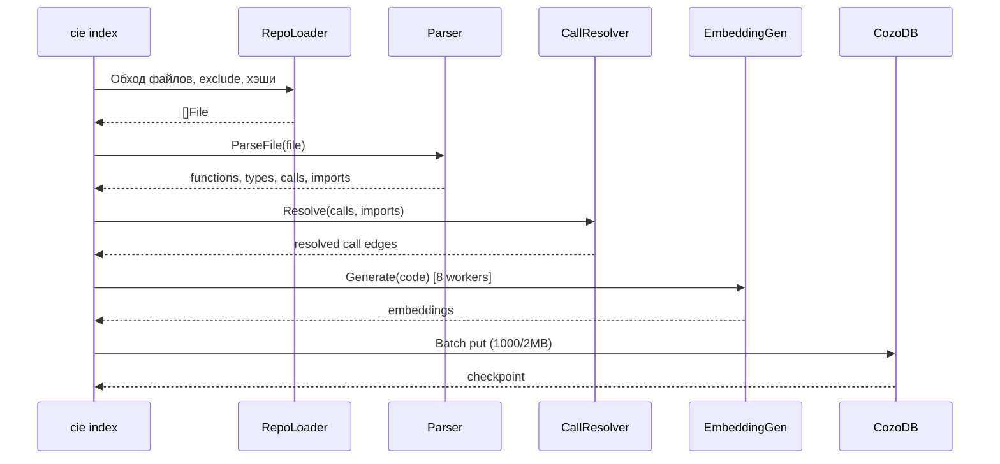
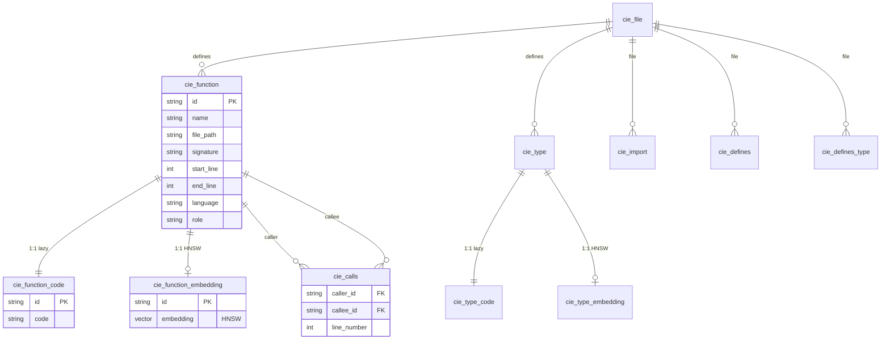
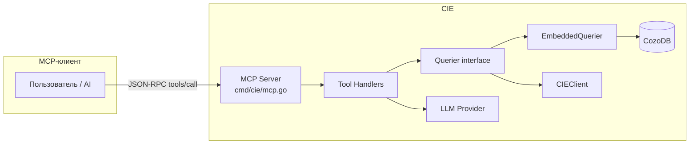
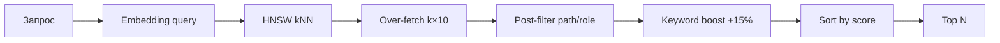
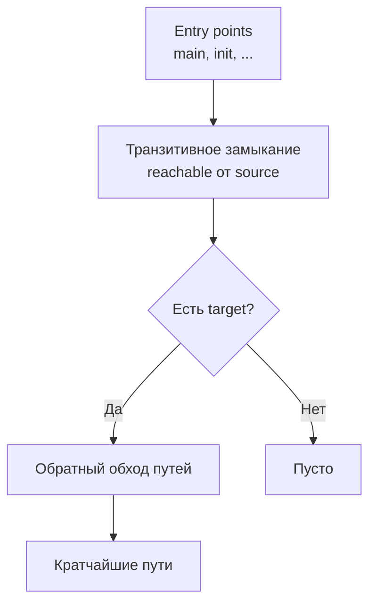

# CIE — Обзор архитектуры и технологий

Документ для быстрого погружения в репозиторий: участники, механики, архитектура и подходы к типовым задачам. Включает Mermaid-диаграммы и ссылки на draw.io диаграммы C1–C4.

---

## 1. Что такое CIE

**CIE (Code Intelligence Engine)** — движок семантического поиска по коду и анализа графа вызовов для AI-агентов. Работает как **MCP-сервер** (Model Context Protocol): один бинарник индексирует репозиторий, хранит индекс локально в CozoDB и отдаёт 20+ инструментов через JSON-RPC по stdin/stdout.

**Ключевые свойства:**
- **Локально:** индекс в `~/.cie/data/<project>/`, код не уходит с машины.
- **Быстро:** ~100k LOC индексируются за секунды, запросы — миллисекунды.
- **Семантика:** поиск по смыслу (эмбеддинги), граф вызовов, обнаружение HTTP/gRPC.

---

## 2. Технологические компоненты (участники)

| Участник | Назначение | Где в коде |
|----------|------------|------------|
| **CLI `cie`** | Точка входа: `init`, `index`, `reset`, `--mcp` | `cmd/cie/` |
| **RepoLoader** | Обход файлов, фильтр по языкам/исключениям, хэши для инкремента | `pkg/ingestion/repo_loader.go` |
| **Tree-sitter парсеры** | AST по файлам, извлечение функций/типов/вызовов/импортов | `pkg/ingestion/parser_*.go` |
| **CallResolver** | Разрешение вызовов между пакетами по импортам и приёмникам | `pkg/ingestion/resolver.go` |
| **EmbeddingGenerator** | Эмбеддинги для функций/типов (Ollama/OpenAI/Nomic), пул воркеров | `pkg/ingestion/embedding.go` |
| **LocalPipeline** | Оркестрация 5 стадий индексации, чекпоинты, батчи в CozoDB | `pkg/ingestion/local_pipeline.go` |
| **CozoDB** | Хранилище: граф (функции, типы, вызовы) + HNSW для векторов | `pkg/cozodb/`, `pkg/storage/` |
| **Querier** | Единый интерфейс запросов: EmbeddedQuerier (локально) или CIEClient (HTTP) | `pkg/tools/client.go`, `client_embedded.go` |
| **20+ MCP Tools** | Реализации инструментов (семантический поиск, граф вызовов, эндпоинты и т.д.) | `pkg/tools/*.go` |
| **MCP Server** | JSON-RPC 2.0 по stdio, регистрация инструментов, вызов обработчиков | `cmd/cie/mcp.go` |
| **LLM/Embedding провайдеры** | Ollama, OpenAI, Nomic — эмбеддинги и опционально LLM для `cie_analyze` | `pkg/llm/` |

---

## 3. Архитектура высокого уровня

Подход: **ETL-пайплайн** (извлечение → преобразование → загрузка) плюс слой запросов.



---

## 4. Пайплайн индексации (механика по стадиям)



**Кратко по стадиям:**

1. **RepoLoader** — только файлы с нужными расширениями (.go, .py, .js, .ts, .proto), исключения из конфига, хэш для инкремента.
2. **Parser** — Tree-sitter → AST, запросы к дереву → функции, типы, вызовы, импорты. Детерминированные ID: `hash(path:name:start-end)`.
3. **CallResolver** — по импортам и алиасам пакетов сопоставляет вызовы с определениями (в т.ч. методы по приёмникам).
4. **EmbeddingGenerator** — пул воркеров, ретраи, L2-нормализация векторов для косинусного поиска через dot product.
5. **Storage** — батчи мутаций в CozoDB (лимиты ~1000 мутаций / ~2MB на транзакцию), чекпоинты по файлам для инкремента.

---

## 5. Схема данных и вертикальное партиционирование

Метаданные, код и эмбеддинги разделены, чтобы не тянуть тяжёлые поля в обычных запросах:



---

## 6. Слой запросов (Tools) и MCP

Все инструменты работают через **Querier** (embedded или HTTP); конкретный бэкенд скрыт.



**Группы инструментов:**
- **Навигация/поиск:** `cie_grep`, `cie_semantic_search`, `cie_find_function`, `cie_find_type`, `cie_list_files`, …
- **Граф вызовов:** `cie_find_callers`, `cie_find_callees`, `cie_trace_path`, `cie_get_call_graph`
- **Понимание кода:** `cie_analyze`, `cie_get_function_code`, `cie_directory_summary`, `cie_find_implementations`
- **HTTP/gRPC:** `cie_list_endpoints`, `cie_list_services`
- **Система:** `cie_index_status`, `cie_search_text`, `cie_raw_query`

---

## 7. Семантический поиск (механика)



Эмбеддинг запроса → поиск по HNSW в `cie_function_embedding` → пост-фильтрация по метаданным → буст по совпадению ключевых слов в имени функции → сортировка и лимит.

---

## 8. Trace path (граф вызовов)



Определяются точки входа (по ролям/конвенциям языка), строится транзитивное замыкание по `cie_calls`, проверяется достижимость целевой функции, затем извлекаются кратчайшие пути.

---

## 9. Подходы к типовым задачам

| Задача | Подход |
|--------|--------|
| **Инкрементальная индексация** | Чекпоинты с хэшами файлов; переиндексируются только изменённые/новые файлы. |
| **Стабильные ссылки на сущности** | Детерминированные ID по `path:name:startLine-endLine` (SHA-256). |
| **Разрешение вызовов между пакетами** | Индекс импортов (алиас → путь пакета), разрешение по полному имени + приёмникам для методов. |
| **Семантика + точное совпадение имён** | Гибрид: HNSW по эмбеддингам + keyword boost по имени функции. |
| **Крупные записи в БД** | Вертикальное партиционирование: metadata / code / embedding; батчи при записи. |
| **Работа без облака** | Режим по умолчанию — embedded CozoDB (RocksDB) на диске; опционально remote Edge Cache. |

---

## 10. Draw.io диаграммы C1–C4

Диаграммы в формате C4 (Context → Container → Component → Code) лежат в каталоге `docs/diagrams/`:

| Уровень | Файл | Содержание |
|---------|------|------------|
| **C1 Context** | `c1-context.drawio` | Система CIE в контексте: пользователь, AI-клиент, опционально Ollama. |
| **C2 Container** | `c2-container.drawio` | Контейнеры: CLI, пайплайн индексации, CozoDB, MCP-сервер, провайдеры эмбеддингов. |
| **C3 Component** | `c3-component.drawio` | Компоненты внутри CIE: RepoLoader, Parser, Resolver, Embedding, Pipeline, Tools, Storage. |
| **C4 Code** | `c4-code.drawio` | Ключевые пакеты/модули: cmd/cie, pkg/ingestion, pkg/tools, pkg/cozodb, pkg/storage, pkg/llm. |

Открывать файлы в [draw.io](https://app.diagrams.net/) или в VS Code с расширением Draw.io Integration.

---

## 11. Структура репозитория (дерево)

```
cie/
├── cmd/cie/           # CLI: main, init, index, reset, mcp, config, …
├── pkg/
│   ├── ingestion/     # RepoLoader, парсеры, Resolver, Embedding, LocalPipeline, schema, batcher, checkpoint
│   ├── tools/         # 20+ инструментов, Querier (client, client_embedded), типы
│   ├── cozodb/        # Обёртка над CozoDB
│   ├── storage/       # Backend, EmbeddedBackend
│   ├── llm/           # Провайдеры эмбеддингов и LLM
│   └── sigparse/      # Парсинг сигнатур
├── docs/              # Документация
│   ├── architecture-overview.md   # этот документ
│   ├── architecture.md            # детальная архитектура
│   └── diagrams/                  # drawio C1–C4
├── go.mod
└── README.md
```

---

## 12. Зависимости (ключевые)

- **Tree-sitter** (`github.com/smacker/go-tree-sitter`) — парсинг кода.
- **CozoDB** — встроенная БД (граф + Datalog + HNSW); CGO.
- **MCP** — протокол JSON-RPC 2.0 по stdio.
- Конфиг: YAML (`.cie/project.yaml`), флаги: `github.com/spf13/pflag`.

---

Документ можно дополнять по мере углубления в конкретные модули. Детали реализации и примеры запросов — в [architecture.md](architecture.md) и [tools-reference.md](tools-reference.md).
